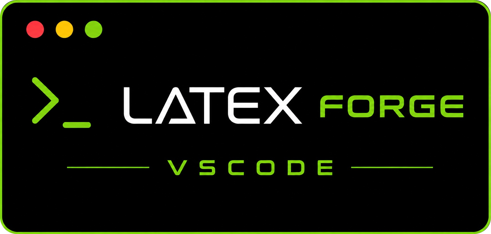

<a href="./README.md">English</a> | <b>Français</b>

  

  
  
  

> **Créez des projets LaTeX prêts à écrire, parcourez une galerie de plus de 80 templates, et gérez toute votre installation LaTeX, sans quitter VS Code ni toucher à un terminal.**

Cette extension est le compagnon visuel de la [CLI LaTeX Forge](https://github.com/thmsgo18/latex-forge) : choisissez un template, donnez un nom à votre projet, et commencez à écrire. L'aperçu PDF est déjà configuré.

## Démarrage

1. Installez cette extension (cliquez sur **Install** dans le bandeau ci-dessus).
2. Cliquez sur **Set Up Now** quand elle propose l'installation initiale (ou lancez **LaTeX Forge: Install Everything**). Elle installe la CLI LaTeX Forge et LaTeX — environ 500 Mo, quelques minutes, **sans Python, sans terminal, sans mot de passe administrateur** — et vérifie qu'un document de test compile. Pas besoin de redémarrer.
3. Ouvrez la palette de commandes (`Cmd+Shift+P` / `Ctrl+Shift+P`) et lancez **LaTeX Forge: Create Project**.

C'est tout : choisissez un template, indiquez un nom, sélectionnez un dossier, et ouvrez votre nouveau projet.

Un guide **Get Started with LaTeX Forge** apparaît également sur la page d'accueil de VS Code après l'installation, reprenant les mêmes étapes ainsi que la galerie et votre profil.

## Fonctionnalités

Toutes les commandes sont accessibles depuis la palette de commandes sous le préfixe **LaTeX Forge:** et envoient leur sortie dans le canal de sortie **LaTeX Forge**.

### Create Project

Choisissez un template (intégré ou installé), indiquez un nom, sélectionnez le dossier de destination, et l'extension lance `latex-forge create` puis propose d'ouvrir le projet généré. Si le dossier choisi contient déjà des fichiers LaTeX, elle vous prévient avant d'imbriquer les projets.

### Browse Template Gallery

Un panneau dans VS Code affichant les templates sélectionnés de la [galerie](https://github.com/thmsgo18/latex-forge-gallery), avec **images d'aperçu**, descriptions, tags, badges de moteur, et un filtrage par catégorie et par texte. Chaque carte propose :

- **Install** : un clic lance `latex-forge template install`
- **Install & Create** : installe le template, puis enchaîne directement sur la création du projet
- **Preview PDF** : aperçu rendu en taille réelle dans votre navigateur
- **View in gallery repo** : le code source du template sur GitHub

Survoler un template dans la vue Templates affiche également son image d'aperçu dans une infobulle.

Le [site de la galerie](https://thmsgo18.github.io/latex-forge-gallery/) propose aussi un bouton **Open in VS Code** sur chaque template ; cliquer dessus installe le template dans cette extension et enchaîne directement sur la création du projet.

### Templates view (activity bar)

Une icône **LaTeX Forge** dédiée dans la barre d'activité liste les templates intégrés et ceux installés par l'utilisateur, avec les actions suivantes dans la barre d'outils :

- **Browse Template Gallery** : ouvre le panneau de la galerie
- **Install Template** : depuis une URL GitHub, une URL ZIP ou un dossier local (tout template avec un `main.tex` fonctionne, pas seulement ceux de la galerie)
- **Update Templates** : vérifie si de nouvelles versions de vos templates installés sont disponibles dans la galerie
- **Remove Template** : avec confirmation
- **Refresh** : recharge la liste

### Project view & Rename

Lorsque l'espace de travail ouvert est un projet LaTeX Forge, la vue **Project** affiche les actions disponibles, dont **Rename Current Project** : le dossier, le fichier `.tex` principal et les fichiers de build sont renommés de façon cohérente via `latex-forge rename`.

### Edit Profile

Un formulaire dans VS Code pour éditer votre profil LaTeX Forge (nom, email, université, encadrant…) stocké dans `~/.latex-forge/profile.toml`. Chaque projet créé ensuite est pré-rempli avec ces valeurs, le même fichier que celui utilisé par `latex-forge profile` côté CLI.

### Configure Defaults

Lit et écrit `default_template` et `default_output_dir` dans `~/.latex-forge.toml` via un menu simple (aucune édition manuelle du TOML).

### Setup Environment & Diagnose

- **Install Everything** : installe tout ce qui manque, avec une notification de progression :
  - la **CLI LaTeX Forge**, via [uv](https://docs.astral.sh/uv/) (téléchargé et vérifié par somme de contrôle par l'extension), sur un Python géré par uv — rien à installer avant, et une mise à jour du Python système ne peut pas la casser ;
  - **LaTeX** : au choix **Légère** (TinyTeX dans votre dossier personnel, ~500 Mo, par défaut), **Complète** (tout TeX Live, ~2 Go) ou **Système** (MacTeX / MiKTeX / TeX Live via le gestionnaire de paquets, lancé dans un terminal car il demande votre mot de passe). Une distribution déjà installée est détectée et laissée telle quelle ;
  - les extensions VS Code recommandées (LaTeX Workshop, LTeX+, correcteurs orthographiques, Live Share) ;
  - puis une compilation de test. Les nouveaux outils sont ajoutés tout de suite au PATH de VS Code (et des nouveaux terminaux) : pas de redémarrage.
- Tant que l'installation n'est pas terminée, un élément **finish setup** apparaît dans la barre d'état et le panneau LaTeX Forge.
- **Paquets manquants installés pour vous** : avec la distribution légère, quand une compilation (y compris celle de LaTeX Workshop à l'enregistrement) signale un paquet, une police ou un style bibliographique manquant, l'extension l'installe et recompile. Désactivable avec `latexForge.autoInstallPackages`.
- **Setup Environment** : tout ce qui précède, plus des options fines — vérifier seulement, choisir la distribution LaTeX, installer seulement les extensions recommandées, installer la CLI GitHub, ou réparer LaTeX (réinstaller TinyTeX après une nouvelle année de TeX Live, en gardant vos paquets).
- **Diagnose Environment** : lance `latex-forge diagnose` et présente le bilan de santé (TeX Live, latexmk, profil, valeurs par défaut) avec des corrections actionnables.

### CLI updates

L'extension vérifie une fois par session si une nouvelle version de la CLI est disponible sur PyPI et propose une mise à jour en un clic avec l'outil qui l'a installée (`uv tool upgrade` ou `pipx upgrade`) (également disponible manuellement via **Check for CLI Update**). Un élément de la barre d'état signale quand une mise à jour est disponible.

## Commandes

| Commande | Description |
|---|---|
| `LaTeX Forge: Create Project` | Nouveau projet à partir d'un template |
| `LaTeX Forge: Browse Template Gallery` | Galerie visuelle avec aperçus et installation en un clic |
| `LaTeX Forge: Install Template` | Installer depuis une URL, un ZIP ou un dossier local |
| `LaTeX Forge: Update Templates` | Mettre à jour les templates installés depuis la galerie |
| `LaTeX Forge: Remove Template` | Supprimer un template installé |
| `LaTeX Forge: List Templates` | Lister les templates dans le canal de sortie |
| `LaTeX Forge: Rename Project` / `Rename Current Project` | Renommer le dossier + le fichier principal de façon cohérente |
| `LaTeX Forge: Edit Profile` | Profil de pré-remplissage (nom, email, université…) |
| `LaTeX Forge: Configure Defaults` | Template et dossier de sortie par défaut |
| `LaTeX Forge: Install Everything (CLI + LaTeX)` | Installation en un clic de la CLI, de LaTeX et des extensions recommandées |
| `LaTeX Forge: Setup Environment` | Options : vérifier seulement, choisir la distribution, CLI GitHub, réparer |
| `LaTeX Forge: Diagnose Environment` | Bilan de santé de l'environnement |
| `LaTeX Forge: Check for CLI Update` | Comparer la CLI installée avec PyPI |
| `LaTeX Forge: Refresh Templates` | Recharger la vue Templates |

## Prérequis

- La **CLI latex-forge** : l'extension n'en est qu'une fine surcouche et ne duplique aucune de ses fonctionnalités. **Install Everything** l'installe pour vous ; `uv tool install latex-forge` ou `pipx install latex-forge` fonctionnent aussi.
- Une **distribution LaTeX** pour compiler : **Install Everything** en installe une (sans mot de passe administrateur), ou utilise celle que vous avez déjà.
- [LaTeX Workshop](https://marketplace.visualstudio.com/items?itemName=James-Yu.latex-workshop) est recommandé pour l'aperçu PDF en direct ; les projets générés sont pré-configurés pour cette extension.

**Note sur la confidentialité :** le réseau n'est utilisé que par le panneau de la galerie (`gallery.json` et images d'aperçu depuis `raw.githubusercontent.com`), la vérification de version sur PyPI, et l'installation, qui télécharge uv et TinyTeX depuis les releases GitHub, latex-forge et un Python depuis PyPI / python-build-standalone (via uv), et les paquets LaTeX depuis les miroirs CTAN. Tout le reste ne communique qu'avec la CLI locale.

## Paramètres de l'extension

- `latexForge.autoInstallPackages` (par défaut `true`) : quand une compilation signale un paquet LaTeX, une police ou un style bibliographique manquant, l'installer et recompiler — seulement avec une distribution qui le permet sans droits administrateur, comme le TinyTeX léger.

Les valeurs par défaut qui influencent `latex-forge create` se trouvent dans `~/.latex-forge.toml` et sont gérées via **LaTeX Forge: Configure Defaults**.

## Limitations connues

- L'installation en un clic nécessite une connexion internet. Avec une distribution **Système** (ou un TeX Live installé pour tout le système), les paquets manquants ne peuvent pas être installés automatiquement : l'extension affiche la commande à lancer.

## Notes de version

Voir le [CHANGELOG](https://github.com/thmsgo18/latex-forge-vscode/blob/main/CHANGELOG.md).

## Contribuer

Les issues et pull requests sont les bienvenues sur le [dépôt GitHub](https://github.com/thmsgo18/latex-forge-vscode). Voir [CONTRIBUTING.md](CONTRIBUTING.md) (en anglais) pour configurer l'environnement de développement, compiler et lancer les tests.

## Licence

[MIT](LICENSE)

## Projets liés

- [**latex-forge**](https://github.com/thmsgo18/latex-forge) : la CLI pilotée par cette extension
- [**latex-forge-gallery**](https://github.com/thmsgo18/latex-forge-gallery) : la galerie de templates et son [site consultable](https://thmsgo18.github.io/latex-forge-gallery/)
- [**latex-forge-skill**](https://github.com/thmsgo18/latex-forge-skill) : un skill Claude qui pilote tout le workflow depuis une conversation

## Auteur

Réalisé par [thmsgo18](https://github.com/thmsgo18)
